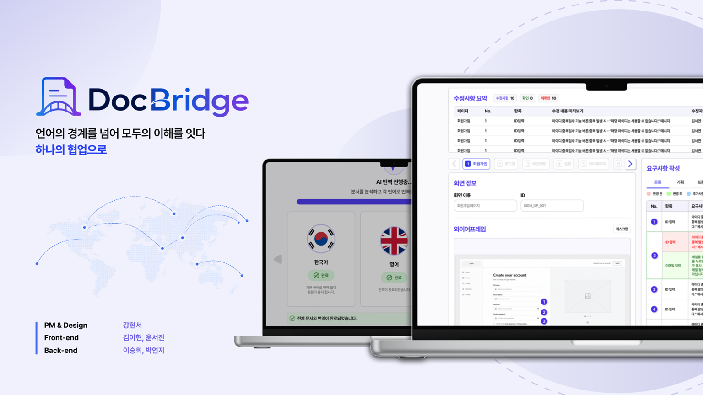

# DocBridge Backend

<div align="center">



> **언어의 경계를 넘어, 모두의 이해를 잇다**
> *Bridge understanding across language barriers — through one collaboration*

</div>

DocBridge는 다국어 협업 문서 플랫폼입니다. 하나의 원본 문서를 작성하면 AI가 팀원의 언어로 자동 번역하고, 원본이 수정되면 모든 언어 버전을 자동으로 동기화합니다.

<br>

## Core Features

| Feature | Description |
|---------|-------------|
| **AI 다국어 자동 번역** | 원본 문서 저장 시 GPT-4o 기반 자동 번역 생성 |
| **실시간 버전 동기화** | 원본 수정 → 전체 언어 버전 자동 업데이트 |
| **Visual Diff** | 변경 전/후 비교를 언어별로 시각화 |
| **스토리보드 편집** | 와이어프레임 + 핀 + 요구사항 기반 기획서 작성 |
| **팀 프로젝트 관리** | 초대 코드 기반 팀 구성 및 역할 관리 |

<br>

## Tech Stack

| Layer | Technology |
|-------|------------|
| Language | Java 21 (Virtual Threads, Records) |
| Framework | Spring Boot 3.3 |
| Security | Spring Security 6.3 + JWT (jjwt 0.12.6) |
| Database | PostgreSQL 17 |
| Cache | Redis 7.4 |
| ORM | JPA / Hibernate 6.5 + Flyway |
| AI Translation | OpenAI GPT-4o |
| File Storage | AWS S3 (prod) / MinIO (local) |
| Real-time | SSE (SseEmitter) |
| API Docs | SpringDoc OpenAPI 2.6 (Swagger UI) |
| Testing | JUnit 5 + Mockito + Testcontainers |
| Infra | Docker + Docker Compose + Nginx |
| CI/CD | GitHub Actions |

<br>

## Architecture

```
┌─────────────────────────────────────────────────────────┐
│                      Nginx (HTTPS)                      │
├─────────────────────────────────────────────────────────┤
│                  Spring Boot Application                │
│  ┌──────────┬──────────┬───────────┬──────────────────┐ │
│  │   Auth   │   Team   │ Document  │   Translation    │ │
│  │  (JWT)   │ Project  │  + Page   │   (GPT-4o AI)    │ │
│  │          │          │  + Pin    │                   │ │
│  │          │          │  + Req    │                   │ │
│  └──────────┴──────────┴───────────┴──────────────────┘ │
├──────────┬──────────────────┬───────────────────────────┤
│   Redis  │   PostgreSQL 17  │        S3 / MinIO         │
│  (Cache) │   (Flyway 관리)   │    (Wireframe Images)     │
└──────────┴──────────────────┴───────────────────────────┘
```


## API Overview

| Domain | Endpoints | Description |
|--------|-----------|-------------|
| Auth | `POST /api/auth/*` | 회원가입, 로그인, 토큰 갱신 |
| User | `GET/PUT /api/users/*` | 프로필 조회/수정 |
| Team | `POST/GET /api/teams/*` | 팀 생성, 초대 코드 참가, 멤버 관리 |
| Document | `POST/GET/PUT/DELETE /api/documents/*` | 문서 CRUD, 버전 관리 |
| Page | `POST/PUT/DELETE /api/documents/*/pages/*` | 페이지 관리, 순서 변경 |
| Pin | `POST/PUT/DELETE /api/pages/*/pins/*` | 핀 좌표 관리 |
| Requirement | `POST/PUT/DELETE /api/pins/*/requirements/*` | 요구사항 관리 (탭별) |
| Translation | `POST/GET /api/documents/*/translate` | AI 번역 요청, 상태 조회 |
| File | `POST /api/files/*` | Presigned URL 발급, 이미지 업로드 |

<br>

## User Flow

```
회원가입 → 로그인 → 대시보드
                        │
                        ├── 팀 프로젝트 생성 (리더)
                        │       │
                        │       ├── 초대 코드 공유 → 멤버 참가
                        │       │
                        │       └── 문서 생성 (리더)
                        │               │
                        │               ├── 페이지 추가 + 와이어프레임 업로드
                        │               ├── 핀 배치 + 요구사항 작성
                        │               ├── 저장 → AI 번역 요청
                        │               │           │
                        │               │           └── 번역 완료 → 멤버별 언어로 문서 열람
                        │               │
                        │               └── 수정 → Visual Diff → 변경사항 확인
                        │
                        └── 팀 프로젝트 참가 (멤버)
                                └── 번역된 문서 열람 (읽기 전용)
```


## Team

| Role | Name |
|------|------|
| PM & Design | 강현서 |
| Frontend | 김아현, 윤서진 |
| Backend | 이승희, 박연지 |

<br>

---

**ITDA** | 멋쟁이사자처럼 인천대학교 14기
